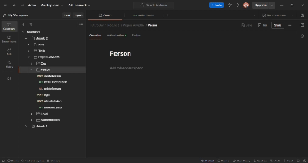
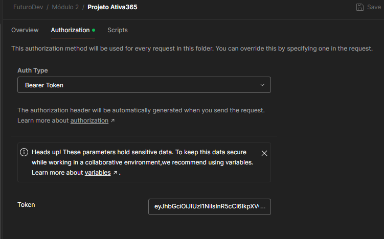
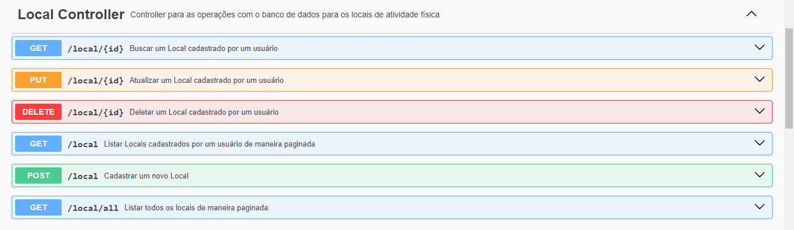
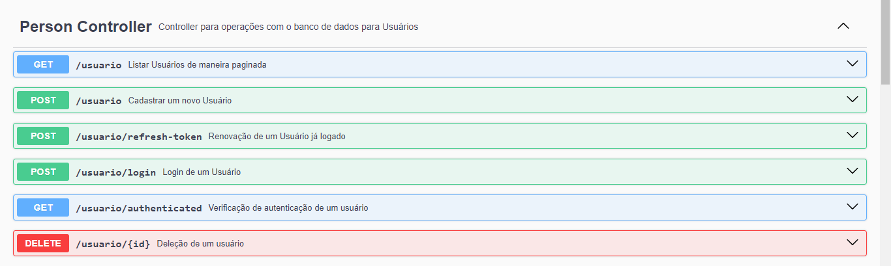
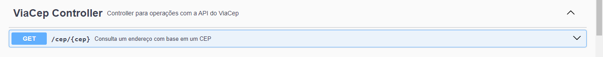

<h1 align="center">Ativa 365</h1>
<p align="center"> <strong> Projeto avaliativo referente ao Módulo 2 - FuturoDev Tubarão V2 </p>
<p align="center">


   
</p>

<div align="center">

[Sobre o projeto](#sobre-o-projeto) • [Funcionalidades ](#funcionalidades) • [Demonstração](#demonstração) • [Como executar](#como-executar-o-projeto-localmente) • [API](#api) • [Local](#local) • [Person](#person)• [Cep](#cep) • [Tecnologias](#tecnologias) • [Melhorias](#melhorias) • [Referências](#referências) • [Autora](#autora) • [Licença](#licença)

</div>

## 💻Sobre o projeto

**Ativa 365** - é uma plataforma que facilita o gerenciamento de exercícios e locais para atividades físicas serem praticadas. Os usuários podem cadastrar novos locais de exercícios, encontrar pontos próximos em um mapa interativo (ou lista), visualizar informações sobre os os exercícios em cada ponto e registrar suas próprias contribuições para o sistema.

Nesta parte do projeto desenvolvemos a API que processa todas as informações e armazenamento no Banco de Dados.
A API foi desenvolvida utilizando Spring Boot e PostgreSql

## Funcionalidades

**Usuário**
- Cadastro de novo usuário
- Login de usuário já cadastrado
- Renovação de token de acesso
- Auto deleção de um usuário
*Extra*- Listagem de todos os usuário não deletados(somente para desenvolvimento)

**Local**
- Cadastro de novo local de treino
- Busca de locais de treino cadastrados pelo usuário
- Busca de um local de treino específico
- Deleção de local de treino cadastrado por um usuário
- Atualização de dados de local de treino
*Extra*- Listagem de todos os locais cadastrados independente do usuário

**CEP**
- Consulta de endereço pelo cep através do ViaCep

## Demonstração



Foi incluso dentro de resource um arquivo da coleção do Postman para facilitar a correção.

## 🚀Como executar o projeto (localmente)

Podemos considerar este projeto como sendo divido em duas partes:

1. Bando de dados (PostgresSql)
2. Back End (API)

### 📋Pré-requisitos

Antes de começar, você vai precisar ter instalado em sua máquina as seguintes ferramentas:
[Git](https://git-scm.com),
[Java](https://www.oracle.com/pk/java/technologies/downloads/) Nesse projeto foi utilizado JDK21,
[Postgres](https://www.postgresql.org/download/),
[Maven - 3.9.8](https://maven.apache.org/download.cgi),
[TomcCat - 9.0.91](https://tomcat.apache.org/download-90.cgi).
Além disto é bom ter um editor para trabalhar com o código como [IntelliJ IDEA](https://www.jetbrains.com/pt-br/idea/download/?section=windows)

### ⚙️Rodando localmente 

#### Preparando o ambiente

É necessário a criação da base de dados relacional no Postgres

```bash
CREATE DATABASE "ativa365"
```
Caso o Postgres esteja configurado com a porta padrão 5432

```bash
http://localhost:5432/ativa365
```
#### Variáveis de Ambiente

O projeto exige algumas variáveis de ambiente:

```
    username: ${DATABASE_USERNAME:username cadastrado no banco}
    password: ${DATABASE_PASSWORD:senha de acesso cadastrada no banco}
```
Alterar os dados de acordo com a configuração do banco na máquina


#### Instalação da Aplicação
Clone o projeto

```bash
  git clone https://github.com/helomt/futurodev_api_ativa365
```

Acesse no diretório do projeto

```bash
  cd futurodev_api_ativa365
```
É preciso compilar o código e baixar as dependências do projeto:


```bash
mvn clean package
```

Finalizado esse passo, vamos iniciar a aplicação:

```bash
mvn spring-boot:run
```

A aplicação tbm pode ser executada através do Editor de Código :
-Executando o arquivo main Ativa365Application

A aplicação será aberta na porta:8080 
- acesse http://localhost:8080

## 🧭API

Para esta APIRESTful foram criados endpoints para três entidades:
Localidade de treino - (Local: /local)
Usuários - (Person: /usuario)
Cep - (ViaCep: /cep)

Algumas rotas são públicas porém para as demais é necessária autenticação através de Bearer Token



Este pode ser adquirido através do login.


<hr>

### 📌Local



### Métodos
Para local foram criados os endpoints dos seguintes métodos

| Método | Descrição |
|---|---|
| `GET` | Retorna informações de um ou mais registros. |
| `POST` | Utilizado para criar um novo registro. |
| `PUT` | Atualiza dados de um registro ou altera sua situação. |
| `DELETE` | Remove um registro do sistema. |


#### Retorna um local de acordo com o parâmetro
```http
  GET /local/{id}
```

*Esta é uma rota que necessita de autenticação e traz o item de acordo com o id informado 
e se estiver dentro do escopo de itens do usuário*

| Parâmetro | Tipo   | Descrição                                                |
|:----------|:-------|:---------------------------------------------------------|
| `id`      | `Long` | **Obrigatório**. Identificação do registro a ser buscado |


#### Atualiza um local de acordo com o parâmetro
```http
  PUT /local/{id}
```
*Esta é uma rota que necessita de autenticação e traz o item de acordo com o id informado
e se estiver dentro do escopo de itens do usuário*

| Parâmetro | Tipo   | Descrição                                                |
|:----------|:-------|:---------------------------------------------------------|
| `id`      | `Long` | **Obrigatório**. Identificação do registro a ser buscado |


Este método exige um corpo em que nenhum campo é obrigatório por ser alteração
````
{
    "name": "Academia 2",
    "description": "Grande descrição",
    "cep": "88705000",
    "activity": "ZUMBA",
    "number": null
    "complement": null
}
````

#### Deleta um local de acordo com o parâmetro
```http
  DELETE /local/{id}
```
*Esta é uma rota que necessita de autenticação e traz o item de acordo com o id informado
e se estiver dentro do escopo de itens do usuário*

| Parâmetro | Tipo   | Descrição                                                |
|:----------|:-------|:---------------------------------------------------------|
| `id`      | `Long` | **Obrigatório**. Identificação do registro a ser buscado |


#### Busca todos locais de registrados pelo usuário
```http
  GET /local
```
*Esta é uma rota que necessita de autenticação e traz o item se estiver dentro do escopo de itens do usuário*


#### Cria um novo local 
```http
  POST /local
```
*Esta é uma rota que necessita de autenticação*

Este método exige um corpo em que *number* e *complement* não são obrigatórios
````
{
    "name": "Academia 2",
    "description": "Grande descrição",
    "cep": "88705000",
    "activity": "ZUMBA",
    "number": null
    "complement": null
}
````

#### Busca todos locais de registrados
Rota pública utilizada somente durante o desenvolvimento do projeto.

```http
  GET /local/all
```
*Esta é uma rota que **não** necessita de autenticação e traz todos os itens do banco.*


<hr>

### 🙎🏻‍♂️Person


### Métodos
Para usuário foram criados os endpoints dos seguintes métodos

| Método | Descrição                                                                   |
|---|-----------------------------------------------------------------------------|
| `GET` | Retorna informações de um ou mais registros.                                |
| `POST` | Utilizado para criar um novo registro ou executar login/renovação de token. |
| `DELETE` | Remove um registro do sistema.                                              |


#### Busca todos os usuários cadastrados no banco
Rota pública utilizada somente durante o desenvolvimento do projeto.

```http
  GET /usuario/
```

*Esta é uma rota que **não** necessita de autenticação e traz todos os itens do banco.*


#### Cria um novo usuário
Rota pública para cadastro de novos usuários


```http
  POST /usuario
```
*Esta é uma rota que **não** necessita de autenticação*

Este método exige um corpo em que *number* e *complement* não são obrigatórios
````
{
    "name": "John Doe",
    "gender": "MALE",
    "cpf": "00000000001",
    "birthday":"1988-12-25",
    "email": "john.doe@exemplo.com",
    "password": "senhaforte",
    "cep": "88705000",
    "number":null,
    "complement":null
}
````
#### Renova um token de acesso do usuário
Rota pública

```http
  POST /usuario/refresh-token
```
*Esta é uma rota que **não** necessita de autenticação, porém necessita do token válido anterior*


#### Login de um usuário
Rota pública

```http
  POST /usuario/login
```
*Esta é uma rota que **não** necessita de autenticação, porém necessita de credenciais válidas contidas no banco*

Este método exige um corpo:

```
{
    "username": "john.doe@exemplo.com",
    "password": "senhaforte"
}
```

Será retornado os dados de acesso contendo o token:

```
{
    "username": "john.doe@exemplo.com",
    "authenticated": true,
    "createdAt": "2024-08-18T12:23:43.142+00:00",
    "expiresAt": "2024-08-18T13:23:43.142+00:00",
    "accessToken": "eyJhbGciOiJIUzI1NCI6IkpXVCJ9.eyJyb2x...",
    "refreshToken": "eyJhbGciOiJInR5cCI6IkpXVCJ9.eyJyb2xl..."
}
```
#### Verificação de autenticação
Rota utilizada somente durante o desenvolvimento do projeto.

```http
  GET /usuario/authenticated
```

*Esta é uma rota que necessita de autenticação.*

Retorna somente : **IsAuthenticated** em caso de uso do acessToken correto.


#### Deleta um usuário de acordo com o parâmetro e autenticação
```http
  DELETE /usuario/{id}
```
*Esta é uma rota que necessita de autenticação e executa a deleção de acordo com o id informado
e se estiver dentro do escopo do usuário*

| Parâmetro | Tipo   | Descrição                                                |
|:----------|:-------|:---------------------------------------------------------|
| `id`      | `Long` | **Obrigatório**. Identificação do registro a ser buscado |


<hr>

### 📫Cep



### Método
Para cep foi criado o endpoint do seguinte método

| Método | Descrição                                                            |
|---|----------------------------------------------------------------------|
| `GET` | Retorna informações de um registro.                                  |

#### Busca dados de um endereço
Rota pública.

```http
  GET /cep/{cep}
```

*Esta é uma rota que **não** necessita de autenticação e traz todos os dados de acordo com a API da ViaCep.*


| Parâmetro | Tipo     | Descrição                                      |
|:----------|:---------|:-----------------------------------------------|
| `cep`     | `String` | **Obrigatório**. Cep do endereço a ser buscado |

Ela retorna os dados da seguinte maneira:

```
{
    "cep": "88705-000",
    "logradouro": "Avenida Marcolino Martins Cabral",
    "complemento": "de 1456 a 2250 - lado par",
    "bairro": "Vila Moema",
    "localidade": "Tubarão",
    "uf": "SC"
}
```
Os dados retornados são utilizados dentro da API para cadastro de usuário e locais através do cep
Os dados contidos em complemento não são atribuidos aos novos cadastros.

Esta API também rotas públicas para a utilização do swagger, que pode ser acessado, após inicialização:

http://localhost:8080/swagger-ui/index.html

## 🛠️Tecnologias

As seguintes ferramentas foram usadas na construção do projeto:

- [SpringBoot](https://spring.io/projects/spring-boot)
- [Spring Data JPA](https://spring.io/projects/spring-data-jpa)
- [Spring Security](https://spring.io/projects/spring-security)
- [SpringMVC](https://spring.io/guides/gs/serving-web-content)
- [Spring Initialzr](https://start.spring.io/)
- [Spring Cloud OpenFeign](https://spring.io/projects/spring-cloud-openfeign)
- [JWT](https://jwt.io/)
- [PostgreSQL](https://www.postgresql.org/download/)
- [Postman](https://www.postman.com/)
- [SWAGGER](https://swagger.io/)


## 🚩Melhorias

Melhorias que ainda podem ser aplicadas:

- Endpoint edição de cadastro do próprio usuário 
- Endpoint de recuperaração de senha
- Criação de entidade própria para o tipo de atividade física
- Endpoints criação, busca, atualização e deleção de atividade física


## Referências
- [Via Cep](https://viacep.com.br/)

## 🐱‍👤Autora

[<br><sub>Heloisa Tavares</sub>](https://github.com/helomt)

<br>

<a target="_blank" href="https://www.linkedin.com/in/heloisamtavares/"></img></a>
<a target="_blank" href="mailto:heloisamt@gmail.com"></img></a>

#### Licença

The [MIT License](https://choosealicense.com/licenses/mit/)

Copyright :copyright: 2024 - Projeto Ativa365


